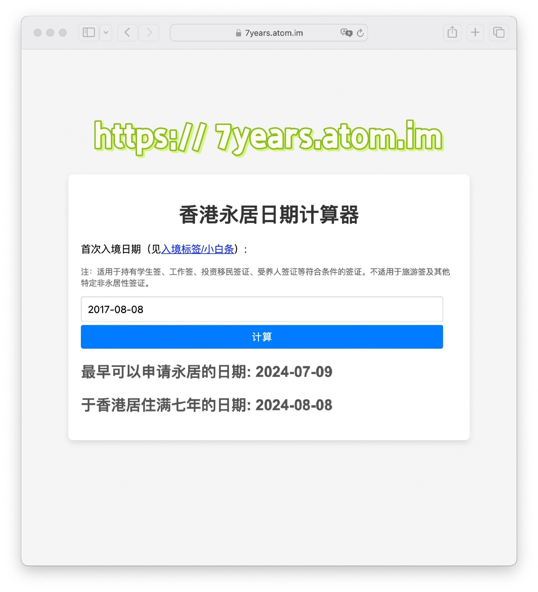
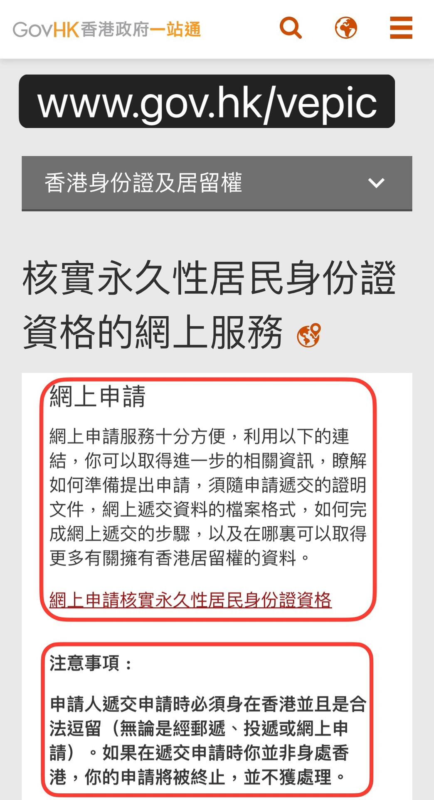
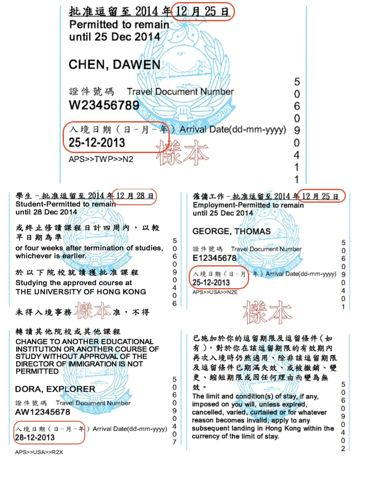
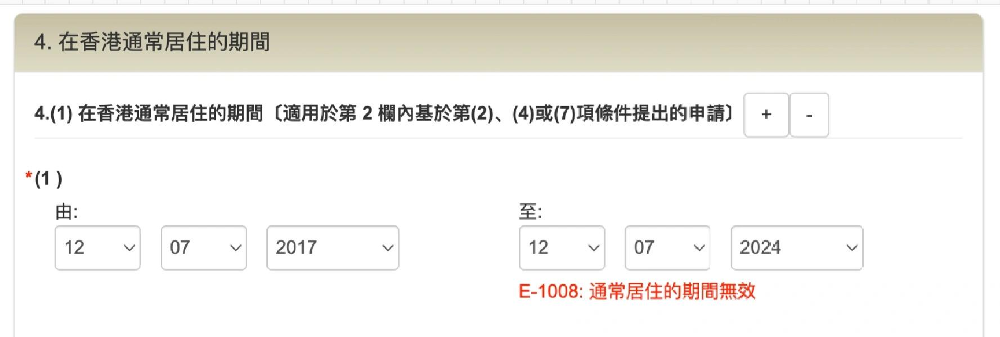
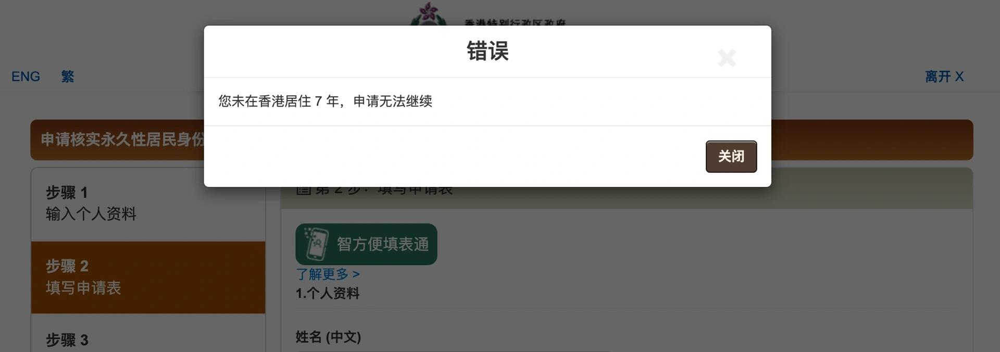
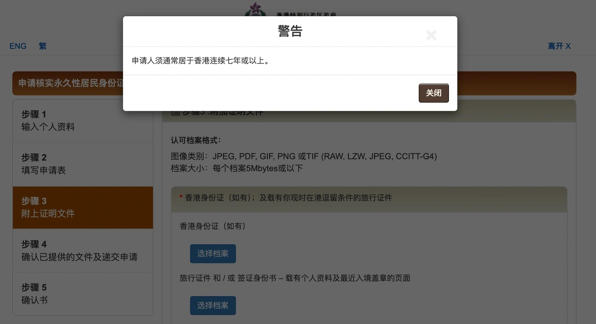
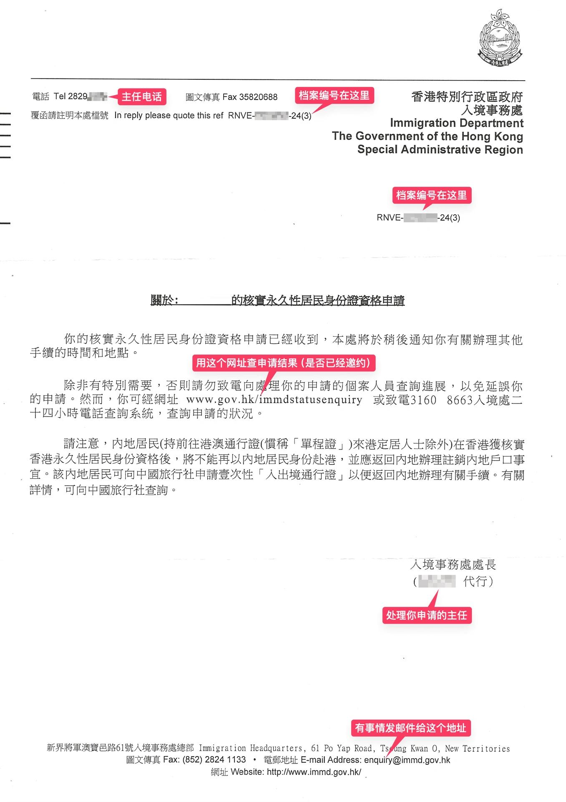
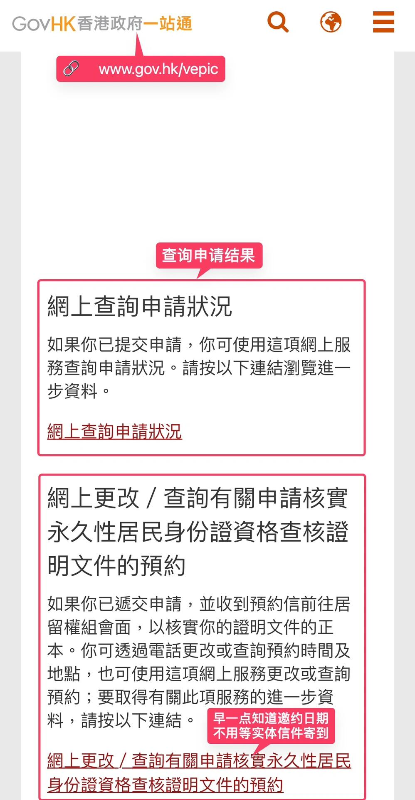
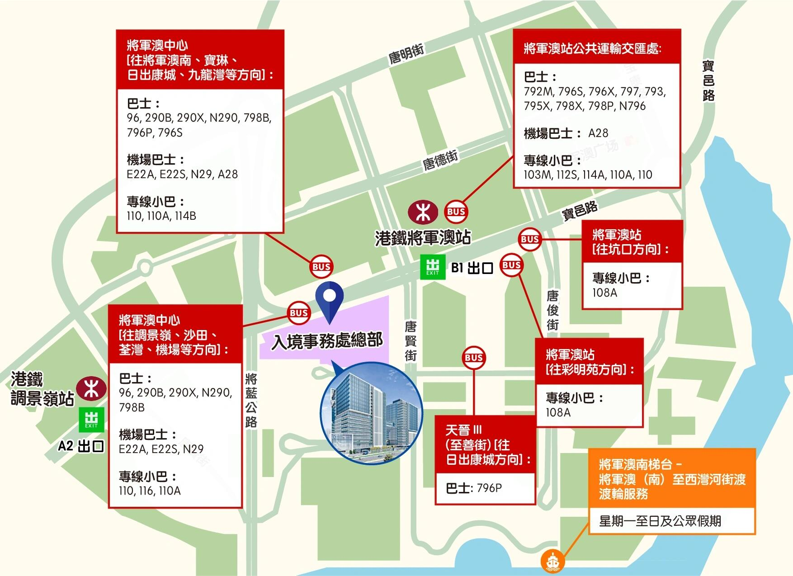

# 🇭🇰 提前一个月申请香港永居

这篇文章以及里面提到的几个开源工具也发在了小红书上面（小红书号：405303732）：[【原创】提前一个月申请香港永居](https://xhslink.com/a/5dIilcCQDV32)。如果有需要的话，大家可以移步小红书查看。无奈文章被很多中介擅自转发，希望看到的朋友随手举报。谢谢。

## 正文

核实香港永居的申请可以在满7年前一个月内（30天）提交。这篇主要就是针对提前一个月申请永居这种情况进行一些说明，希望可以帮助有需要的人合理安排时间。

### 申请步骤

1. **提交申请时间**：
   - 所有人，无论持单程证（前往港澳通行证）、双程证（往来港澳通行证）或护照，都只能【提前最多30天】提交申请。提前超过30天申请的话，即使能在系统提交（比如单程证），后面也会收到拒信，白白浪费时间。
   - 我写了[🔗 香港永居日期计算器](https://7years.atom.im)，可以提前计算最早哪天可以提交。见[图1](#图1)。

2. **访问永居申请网站**：
   - 访问 [🔗 www.gov.hk/vepic](https://www.gov.hk/vepic)（见[图2](#图2)）。
   - 网上申请核实永久性居民身份证资格→步骤2填写申请表→（双程证）第4.1项在香港通常居住的期间。填写由A至B两个日期。日期A是当年首次入境日期（见首次入境小白条，[图3](#图3)，旅游签不算），比如2017年7月12日。

3. **填写日期B**：
   - 日期B最晚可以填申请日期当天，不能为后面满7年的日期2024年7月12日，否则系统会报“E-1008 通常居住的期间无效”的错误，无法继续下一步。见[图4](#图4)红色提示。

4. **提交申请时间的限制**：
   - 如果提前超过一个月申请，比如提早一天在6月11日申请，提交时会弹出“错误”，提示“您未在香港居住7年，申请无法继续”。见[图5](#图5)。
   - 如果在一个月以内申请，也就是6月12日0点以后申请，则会弹出“警告”，提示“申请人须通常居于香港连续七年或以上”。但是已经到步骤3附加证明文件了，关闭警告接着传文件就行了。见[图6](#图6)。

5. **申请时的注意事项**：
   - 网上递交申请时，申请人【必须】【必须】【必须】身在香港。申请后可以离港。

6. **收到确认信**：
   - 申请后一般一周内会收到第一封信，确认收到申请，如[图7](#图7)。材料齐全的话，审批需要大概四到六周。但是快的一两个星期，慢的一两个月都有可能。大部分主任会在满7年日期之后才寄出邀约信；也有一些主任会在满7年之前就寄出邀约信，但是会在信里明确告知不能将见主任的时间更改到满7年的日期之前。

7. **查询申请状态**：
   - 申请后可以用档案编号查询申请状况，如果出现“E-1002：找不到任何相关记录”，那就再等等。也可以去「网上更改／查询有关申请核实永久性居民身份证资格查核证明文件的预约」查，早一点知道邀约，见[图8](#图8)。档案编号和验证码（0-9、A-Z）见第一封信上方。

8. **入境事务处搬迁**：
   - 入境事务处总部于2024年6月11日从湾仔搬迁至将军澳了，见主任别跑错地方了。交通见[图9](#图9)。

内容仅供参考，具体以申请系统为准。

### 小工具

在申请永居的过程中，写了几个相关的小工具，包括申请前提前计算最早可以申请香港永居的日期，准备材料时速查判断是否离港超过180天和具体的日期，以及申请后自动查询邀约见主任信息方便第一时间获悉永居申请结果。这几个小工具都开源了，可以访问下面的代码库查看使用。

- [🔗 香港永居日期计算器](https://7years.atom.im)
  

- [🔗 申请香港永居：速查离港超过180天日期](https://180days.atom.im/)
  

- [🔗 第一时间获取香港永居申请结果](https://github.com/atom-im/hkpr)
  

㊗️ 祝大家早日顺利申请香港永居！

## 配图

<b>图1：香港永居日期计算器</b>

  

---

<b>图2：网上申请核实永久性居民身份证资格步骤</b>

  

---

<b>图3：首次入境小白条</b>

  

---

<b>图4：系统报错提示</b>

  

---

<b>图5：提前超过一个月申请的错误提示</b>

  

---

<b>图6：一个月以内申请的警告提示</b>

  

---

<b>图7：确认收到申请的第一封信</b>

  

---

<b>图8：查询申请状况的界面</b>

  

---

<b>图9：入境事务处总部搬迁后的交通信息</b>

  

---
